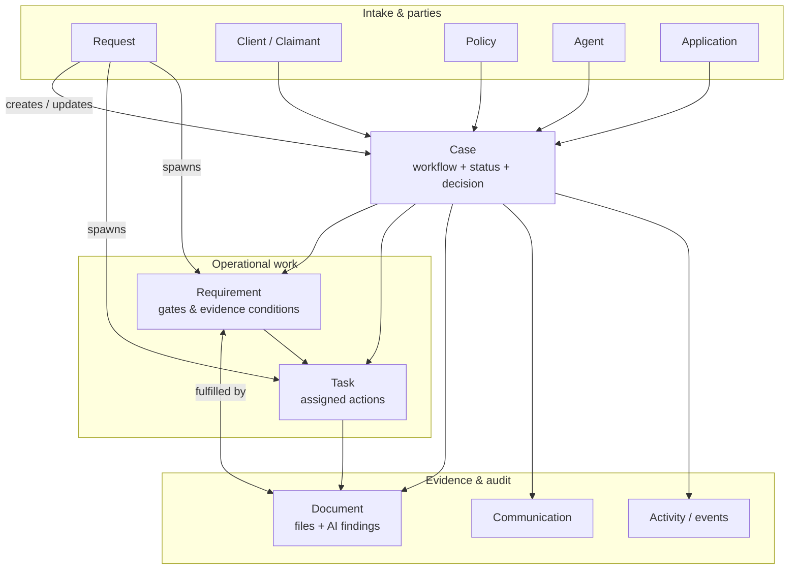
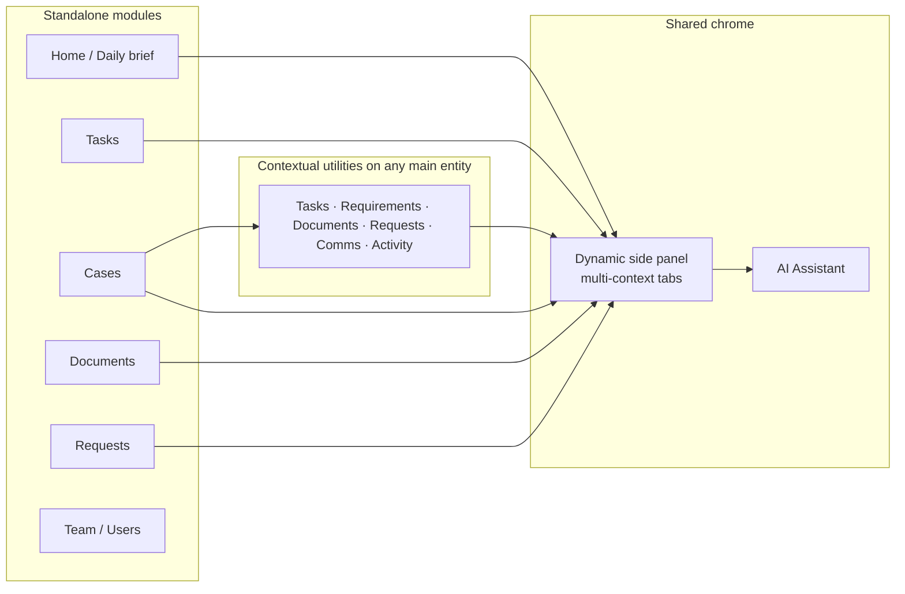
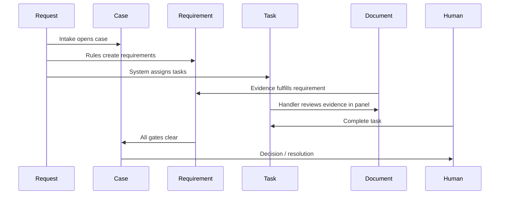

# Pitch deck brief — Amplify object model & anatomy

Use this document with Claude (or similar) to generate slides. It describes **two core schematizations** and the **anatomy of five work objects** as implemented in the Amplify Case Management demo.

---

## Product one-liner

**Amplify Case Management** is a work-orchestration platform for insurance operations. It connects cases, evidence, requirements, tasks, and intake requests in one graph—so teams see **context before action**, with AI summaries and evidence review embedded in the same workspace (not bolted on).

**Experience principles (slide fodder):**

- Context before action  
- Object-centered work (not isolated pages)  
- AI at the right moment  
- Dynamic side panels (stay oriented while drilling into linked objects)  
- Explainable automation (system steps + human actions visible)

---

## Schematization 1 — The work graph (case at the center)

**Message for deck:** A case is the **workflow container**. Everything else hangs off it: who is involved, what must be proven, what work is assigned, what came in from outside, and what files support the decision.

**Talking points:**

| Relationship | Meaning |
|--------------|---------|
| **Case ↔ Requirement** | “What must be true or on file before we advance?” (medical, financial, FNOL, application, etc.) |
| **Case ↔ Task** | “Who does what next?” (review, chase, triage, decision prep) |
| **Requirement ↔ Document** | Evidence fulfills or challenges a requirement |
| **Task ↔ Document** | Work item opens directly on the proof (evidence preview in task panel) |
| **Request ↔ Case** | Intake (portal, advisor, employer) opens or updates a case |
| **Request → Task / Requirement** | System or rules generate follow-up work from intake |

**Case types in demo:** claim, new business, customer service, agent onboarding—each reuses the same object graph with different tabs (e.g. Decision, Scoring, Resolution).

---

## Schematization 2 — Dual surface: modules + contextual utilities

**Message for deck:** Users can work **globally** (module home) or **in context** (inside a case or side panel)—same objects, same links, no re-entry.

**Main entities (folders / admin depth):** Client, Policy, Agent, Application  
**Work objects (pitch focus):** Case, Requirement, Task, Request, Document  
**Intelligence layer:** Document evidence (page anchors), AI actions, assistant responses  

**Side panel flow (one slide story):**

1. Open a **task** from Home or Tasks module  
2. See linked **case** and **requirement** in metadata  
3. Jump to **requirement** tab (Overview · Context · Relationship · Activity)  
4. Open **document** evidence inline (preview + AI insights, side-by-side on desktop)  
5. Ask **Assistant** without losing place  
6. Complete the **task** action  

---

## Shared anatomy pattern (all work objects)

Every object side panel follows the same **three-band** layout—good for a single “platform consistency” slide:

| Band | Purpose |
|------|---------|
| **Header** | Identity, status chips, key metadata grid (stage, dates, parties, source) |
| **Body (tabbed)** | Summary, context, relationships, activity—content varies by object |
| **Footer** | Primary + secondary **actions** (data-driven per object/status) |

**Panel tabs (recent product pattern):**

- **Requests:** Overview · Submitted form · Activity log · **Relationship**  
- **Requirements:** Overview · **Context** (context + evidence) · **Relationship** (tasks) · Activity  

---

## Object anatomy — Case

**What it is:** Workflow entity that organizes status, participants, work, evidence, and outcomes.

**Header (identity bar):**

- Case ID, type (claim / NB / service / onboarding)  
- Status, SLA, assignee  
- Primary party (claimant / applicant / customer)  
- Linked policy, product, advisor  

**Tabs (case workspace):**

| Tab | What’s inside |
|-----|----------------|
| **General information** | AI case brief, structured fields, client headline, suggested focus (task → requirement links) |
| **Requirements** | Table of gates; open requirement in side panel |
| **Tasks** | Case-scoped work queue |
| **Documents** | Evidence library for the case |
| **Communications** | Interaction history |
| **Activities** | Audit / timeline |
| **Decision / Scoring** | (varies by case type) Recommendation, factors, approval |

**Linked main entities:** Client, Policy, Agent, Application (by case type)

**Lifecycle outputs:** Tasks, Requirements, Requests, Documents, Communications

**Pitch line:** *The case is the single pane of glass for “where is this file?”—not a static record, but a living workflow.*

---

## Object anatomy — Requirement

**What it is:** A condition or evidence gate that must be satisfied (or waived) to progress the workflow.

**Header:**

- Category, status (Fulfilled, Overdue, Pending, …)  
- Requirement ID  
- Stage, due date, responsible party, source (system / medical / external)

**Panel tabs:**

| Tab | What’s inside |
|-----|----------------|
| **Overview** | Blocking callout, **AI summary**, key stats, fulfilment criteria checklist, scoring widget |
| **Context** | Business context card (type, description, key-value fields) **+ linked evidence documents** |
| **Relationship** | Linked **tasks** that operationalize this requirement |
| **Activity** | Audit trail (ordered, fulfilled, chased, etc.) |

**Key fields (conceptual):** status, stage, dueDate, fulfillmentCriteria, blockingImpact, aiSummary, linkedDocs, linkedTasks

**Pitch line:** *Requirements connect “what the rules need” to “what’s on file” and “who’s doing the work.”*

---

## Object anatomy — Task

**What it is:** An assigned unit of work—created by users, workflows, requests, or AI—with a clear path to completion.

**Header:**

- Priority, status  
- Task ID  
- Case stage, assignee, due window  
- Case link, claimant (+ policy role)

**Body sections:**

| Section | What’s inside |
|---------|----------------|
| **Summary** | AI narrative or checklist (“suggested next steps”) |
| **Evidence preview** | Thumbnail cards → open **document** in nested panel context |
| **Scoring** | (when relevant) Mini widget tied to underwriting |
| **Linked objects** | Requirements, documents, requests, case |

**Footer actions (examples):** Complete · View application / View APS · Request info · Add requirement

**Key fields:** label, status, priority, assignee, stage, evidenceDocuments, summary.checklist, actions[], linkedObjects

**Pitch line:** *Tasks are not todos—they carry evidence, links, and AI guidance so the handler knows **how** to complete the work.*

---

## Object anatomy — Document

**What it is:** Evidence-bearing file with metadata, validation status, and AI-extracted findings.

**Header:**

- Title / filename  
- Category (Medical, Legal, Financial, …)  
- Status (Validated, Pending review, …)  
- Case, claimant, source, received date  

**Body (evidence viewer):**

| Zone | What’s inside |
|------|----------------|
| **Canvas** | Page preview (PNG/PDF), zoom/pan, highlight anchors |
| **Insights column** | AI findings (quote, reasoning, impact), connector lines to highlights |
| **Summary** | Why this document matters for the requirement / case |
| **Actions** | Mark reviewed, request follow-up |

**Relationships:** Linked to Case, Requirement(s), Task(s), Request

**Intelligence:** `document_evidence` record = pages + findings (anchors calibrated to preview)

**Pitch line:** *Documents are the proof layer—AI reads them, humans confirm them, requirements consume them.*

---

## Object anatomy — Request

**What it is:** Inbound or outbound ask (portal, advisor, phone, employer, internal)—often the **start** of work.

**Header:**

- Category (Claims, New business, Service, …)  
- Priority, status  
- Request ID  
- Sub-type, received date/time, channel  
- Assignee, requester, requester role  

**Panel tabs:**

| Tab | What’s inside |
|-----|----------------|
| **Overview** | System-initiated steps, **summary**, stats grid (case created, requirements generated, tasks created, AI vs human actions), recent activity |
| **Submitted form** | Structured intake fields (who, what, when, product, etc.) |
| **Activity log** | AI crew actions + human actions (timeline) |
| **Relationship** | Linked **case**, **tasks**, **requirements**, evidence snapshot |

**Lifecycle:** Request received → case opened/updated → requirements & tasks generated → evidence attached → human completes work

**Pitch line:** *Requests make intake auditable—you see the form, what the system did, and what was created.*

---

## End-to-end story (one narrative slide)

**Example (Empire NB):** Advisor submits application (request) → case `NB-2026-4401` → requirement “Application & needs analysis” → task “Complete application triage” → document Application PDF → APS requirement still open → daily brief suggests next focus.

---

## Suggested slide outline (12–14 slides)

1. **Title** — Amplify Case Management  
2. **Problem** — Fragmented ops tools, context switching, opaque AI  
3. **Principles** — Context before action, object-centered work  
4. **Schematization 1** — Case-centric work graph (diagram)  
5. **Schematization 2** — Modules + contextual utilities (diagram)  
6. **Case anatomy** — Tabs + decision path  
7. **Requirement anatomy** — Gates, context, evidence, tasks  
8. **Task anatomy** — Work with evidence path to completion  
9. **Document anatomy** — AI evidence viewer  
10. **Request anatomy** — Intake + system steps + relationships  
11. **Side panel story** — One flow, no page hopping  
12. **AI layer** — Brief, summaries, findings, activity feeds  
13. **Demo datasets** — SBLI, Guardian, Empire (multi-line, multi-jurisdiction)  
14. **Vision** — Configurable, AI-assisted operations platform  

---

## Placeholder for your schematizations

*Drop screenshots or sketches here when ready—the deck can mirror your visual language.*

| Your asset | Maps to |
|------------|---------|
| _(screenshot 1)_ | Schematization 1 — object graph |
| _(screenshot 2)_ | Schematization 2 — modules vs utilities / panel |
| _(anatomy wireframes)_ | Per-object header / tabs / footer |

---

## Glossary (short)

| Term | Definition |
|------|------------|
| **Main entity** | Long-lived business object: Client, Policy, Agent, Case |
| **Work object** | Operational item: Requirement, Task, Request |
| **Utility** | Capability attached to an entity: tasks tab on a case, documents on a policy |
| **linkedObjects** | Graph edges between objects (navigation + panel context) |
| **Daily brief** | Home/dashboard AI summary with deep links to task & requirement |
| **Relationship tab** | Panel tab for linked tasks, case, requirements (formerly “linked records”) |

---

*Source: `PRODUCT_VISION.md`, `entityAnatomy.ts`, `dataArchitecture.ts`, and live UI patterns in the CM Multicase sandbox.*
