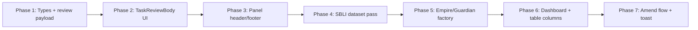

# Task semi-auto redesign — deep analysis & simplification plan

**Goal:** Tasks should be **fast to approve**. AI does the work; the human reads **one short reasoning block**, optionally opens evidence, then **Approve** or **Amend (reject)**. Reading five redundant sections does not make work faster — it slows people down.

---

## Executive summary

| Today | Target |
|-------|--------|
| 5–7 content layers per task panel | **2 layers** (verdict + optional evidence) |
| Same text copied across 4–5 fields | **One canonical field:** `aiVerdict` |
| Generic “suggested next steps” on every task | **Removed** for semi-auto; kept only for manual tasks |
| Primary action: “Complete” | **Approve** (+ **Amend** secondary) |
| 6-field metadata grid always visible | **3 chips** in header (due · case · assignee) |
| Evidence section open by default | **Collapsed** “View evidence (N)” |

---

## 1. What the user sees today (problem)

Opening a task side panel currently stacks **all of this**:

```
┌─ HEADER ─────────────────────────────────────────────┐
│ [AI] [Status] [Priority]  task_emp_ci_002            │
│ Task title (18px)                                    │
│ ┌─ METADATA GRID (6 cells) ────────────────────────┐ │
│ │ Case stage │ Assignee │ Due │ Case │ Claimant │ Linked │
│ └──────────────────────────────────────────────────┘ │
├─ BODY (scroll) ──────────────────────────────────────┤
│ ┌─ ALERT BANNER (optional) ────────────────────────┐ │
│ └──────────────────────────────────────────────────┘ │
│ ┌─ AI SUMMARY BOX ─────────────────────────────────┐ │
│ │ ① aiNarrative / aiSummary (paragraph)           │ │
│ │ ② intro paragraph (summary.description)         │ │  ← DUPLICATE
│ │ ┌─ TASK CONTEXT CARD ─────────────────────────┐ │ │
│ │ │ label: "Task context"                        │ │ │
│ │ │ title (same as task label)                   │ │ │  ← DUPLICATE
│ │ │ description (same paragraph again)           │ │ │  ← DUPLICATE
│ │ │ "Suggested next steps"                       │ │ │
│ │ │ • step 1 (same as checklist)                 │ │ │  ← DUPLICATE
│ │ │ • step 2                                     │ │ │
│ │ └──────────────────────────────────────────────┘ │ │
│ │ OR contextCards[] (policy card, step readiness…) │ │  ← MORE DUplication
│ └──────────────────────────────────────────────────┘ │
│ ScoringMiniWidget (if case has scoring)              │
│ ┌─ Evidence preview (OPEN by default) ──────────────┐ │
│ │ doc thumb + aiSummary + follow-ups badge         │ │
│ └──────────────────────────────────────────────────┘ │
├─ FOOTER ─────────────────────────────────────────────┤
│ [View evidence]  [Complete]  [Add requirement]       │
└──────────────────────────────────────────────────────┘
```

**Estimated read burden:** 150–400 words before the user can act. For semi-auto tasks, **90% of that text repeats the same idea**.

---

## 2. Content duplication in data (root cause)

### 2.1 Field overlap

The task record carries **six narrative fields** that often say the same thing:

| Field | Role today | Problem |
|-------|------------|---------|
| `aiSummary` | Table column + panel | Duplicated into `aiNarrative.text` in SBLI |
| `aiNarrative.text` | Panel “AI block” | Often **identical** to `aiSummary` |
| `description` | Legacy / table | Copy of summary |
| `summary.description` | Task context card body | Copy again |
| `panelContext.contextSummary` | Fallback in UI | Copy again (SBLI: explicit) |
| `summary.checklist` | Suggested steps | Duplicated in `panelContext.suggestions` |

**Example — SBLI `task_cd5211` (AI disability narrative):**

The same paragraph appears in **`aiSummary`**, **`aiNarrative.text`**, **`description`**, **`summary.description`**, and **`panelContext.contextSummary`**. The checklist appears in both **`summary.checklist`** and **`panelContext.suggestions`**.

### 2.2 Factory defaults (Empire / Guardian)

Every task created via the `task()` helper gets a **generic boilerplate** even when unnecessary:

```ts
summary: {
  contextLabel: 'Task context',
  title: label,                    // = task title (already in header)
  description,                     // = aiSummary or label
  checklist: [
    `Review ${label.toLowerCase()}`,
    'Update case notes and advisor copy',
    'Confirm requirement status',
  ],
}
```

Result: **18 Empire + 20 Guardian tasks** all show fake “suggested next steps” that don’t reflect AI work already done.

### 2.3 UI fallbacks add noise

`TaskSummaryBody.tsx` and `objectRepository.ts` inject **more** generic copy when fields are missing:

- Default intro: *“This task was created because the case has a pending control point…”*
- Default steps: *Review case context · Take the next action · Document the outcome*
- Default `panelContext.suggestions`: *Review linked entities · Confirm ownership · Update task status*

So even sparse tasks feel heavy.

### 2.4 Dataset inventory

| Dataset | Task count (approx.) | Rich content (`contextCards`, `panelContext`) | AI-heavy |
|---------|---------------------|-----------------------------------------------|----------|
| **SBLI** | ~40 | ~27 tasks — full triple stack | ~10 `aiGenerated` / AI Agent assignee |
| **Empire** | 18 | 1 task with `contextCards` | Most have `aiSummary`; factory checklist on all |
| **Guardian** | 20 | Similar to Empire | Same pattern |
| **mock-tasks** (legacy) | ~20 | `panelContext` on key demos | WOP decision task |

**Total catalog:** ~98 dataset tasks + legacy mock overlay.

---

## 3. Task modes (new concept)

Not every task is semi-auto. Classify at the **record** level:

| Mode | When | User job | Panel shape |
|------|------|----------|-------------|
| **`semi_auto`** | AI executed; output ready for sign-off | Read verdict → Approve or Amend | Minimal (see §4) |
| **`manual`** | Human must act (chase, call, schedule) | Do the work → Complete | Short **action line** + 1–3 bullets max |
| **`exception`** | SLA, conflict, missing evidence | Resolve blocker → then Approve | Alert + verdict + evidence required |

**Derivation rules (demo):**

```
semi_auto  IF aiGenerated OR assignee === 'AI Agent' OR primary action is review/approve
manual     IF label matches chase|follow-up|schedule|interview|contact
exception  IF alert.type in (sla, blocking, overdue) AND status !== Completed
```

---

## 4. Target panel — semi-auto layout

```
┌─ HEADER (compact) ───────────────────────────────────┐
│ [Semi-auto · 91%]  task_emp_ci_002        [Due: 2d]│
│ Validate specialist diagnosis letter               │
│ Case CD26-5546112 · Sophie Chen · Medical review   │
├─ VERDICT (single block) ─────────────────────────────┤
│ ✦ AI conclusion                                    │
│ Invasive ductal carcinoma confirmed — meets Empire   │
│ Life CI definition. Recommend full $125k payout.     │
│                                                      │
│ [View reasoning]  ← expands: sources, 2–3 bullets   │
├─ EVIDENCE (collapsed) ───────────────────────────────┤
│ ▸ View evidence (2 documents)                      │
├─ FOOTER ─────────────────────────────────────────────┤
│ [ Approve ]              [ Amend ]                   │
└──────────────────────────────────────────────────────┘
```

**Rules:**

1. **One narrative** — `aiVerdict` (max ~280 chars visible; expand for detail).
2. **No** separate “Task context” card for semi-auto.
3. **No** “Suggested next steps” — AI already did them; approving records acceptance.
4. **Evidence** — collapsed row; open side panel only if user doubts the verdict.
5. **Approve** maps to `complete` workflow action; **Amend** opens lightweight reject flow (reason + optional re-route).

### Manual task (contrast)

```
│ Chase employer physician statement                   │
│ ⚠ Overdue 2 days                                     │
│ Action: Contact Maple Tech HR for own-occupation     │
│ wording on physician statement.                      │
│ • Call HR · reference req_emp_di_003                   │
│ [ Mark complete ]  [ Request info ]                  │
```

Max **3 bullets**, no AI verdict block.

---

## 5. Data model simplification

### 5.1 New canonical shape

```ts
type TaskExecutionMode = 'semi_auto' | 'manual' | 'exception';

interface TaskReviewPayload {
  /** Single user-facing conclusion — THE field to read */
  verdict: string;
  /** Optional expand: how AI got there (2–4 bullets max) */
  reasoning?: string[];
  /** 0–100; shown as chip when present */
  confidence?: number;
  /** doc ids supporting verdict — not duplicated summaries */
  evidenceIds?: string[];
}

interface DatasetTaskRecord {
  // ... identity, status, assignee, stage, linkedObjects ...

  executionMode: TaskExecutionMode;
  review?: TaskReviewPayload;

  /** DEPRECATE → migrate into review.verdict */
  aiSummary?: string;
  aiNarrative?: TaskAiNarrative | null;
  summary?: TaskSummaryBlock;
  panelContext?: TaskPanelContext;
  contextCards?: TaskContextCard[];
}
```

### 5.2 Migration mapping

| Old | New |
|-----|-----|
| `aiNarrative.text` or `aiSummary` | `review.verdict` (pick **one**, dedupe) |
| `aiNarrative.confidence` | `review.confidence` |
| `summary.checklist` (semi-auto) | **delete** or move 2 items max to `review.reasoning` |
| `contextCards`, `panelContext` | **delete** for semi-auto; keep only for manual if needed |
| `summary.title`, `summary.description` | **delete** (title = `label`) |
| Generic factory checklist | **remove** from Empire/Guardian helper |

### 5.3 Projection layer (`objectRepository.toTask`)

Stop synthesizing fat `panelContext` defaults:

```ts
// REMOVE this fallback block for semi_auto tasks:
panelContext: {
  contextSummary: `Dataset task linked to ${case}...`,
  suggestions: ['Review linked entities', ...],
}
```

Add:

```ts
executionMode: row.executionMode ?? inferExecutionMode(row),
review: row.review ?? legacyToReview(row),
```

---

## 6. UI component plan

| File | Change |
|------|--------|
| `TaskSummaryBody.tsx` | Replace with `TaskReviewBody.tsx` — mode switch (`semi_auto` / `manual` / `exception`) |
| `TaskDetailSidePanel.tsx` | Shrink header grid 6→3; footer **Approve / Amend**; evidence collapsed |
| `objectRepository.ts` | Slim projection; stop default `panelContext` |
| `dashboardLiveProjection.ts` | `focus.reason` = `review.verdict` (one line) |
| `TaskModule` table | Keep `aiSummary` column → show `verdict` truncated |
| `EmpowerRequirementView` | Out of scope for v1 (separate panel) |

### Footer actions by mode

| Mode | Primary | Secondary |
|------|---------|-----------|
| semi_auto | **Approve** | **Amend** |
| manual | **Complete** | Request info |
| exception | **Resolve & approve** | Escalate / Amend |
| team queue | Pick up | — |
| completed | View evidence | — |

---

## 7. Per-dataset simplification pass

### SBLI (~40 tasks) — highest ROI

For each task:

1. Set `executionMode`.
2. Set `review.verdict` = best single paragraph (usually current `aiNarrative.text`).
3. Move 2–3 supporting points to `review.reasoning` **only if** they add facts not in verdict.
4. Remove `summary`, `panelContext`, `contextCards` where redundant.
5. Rename actions: `Complete` → `Approve` for semi-auto; keep `Complete` for manual chases.

**Priority examples:**

| Task ID | Today (words*) | Target verdict (example) |
|---------|----------------|--------------------------|
| `task_cd5211` | ~120 duplicated | Same text **once** + Approve |
| `task_cd5180` | ~80 + policy card | manual — “Verify WOP rider active; FNOL registered.” + 2 bullets |
| `task_emp_nb_001` (Empire triage) | generic checklist | semi_auto — “Application complete; triage passed; route to APS order.” |

\*Approximate unique reading load.

### Empire / Guardian (~38 tasks)

1. Change `task()` factory: **no default `summary` block**.
2. Set `executionMode: 'semi_auto'` when `aiSummary` present and task is review-type.
3. Set `executionMode: 'manual'` for chase/follow-up labels.
4. One-line `review.verdict` from existing `aiSummary`.

### Legacy `mock-tasks.ts`

Align WOP / Guardian demo tasks with new shape so CaseView + Dashboard stay consistent.

---

## 8. Before / after example

### Before — `task_emp_ci_002` (Validate specialist diagnosis letter)

**User reads:**

1. Header title  
2. aiSummary in summary box  
3. Task context card title (same as header)  
4. Task context description (same as aiSummary)  
5. 3 generic checklist items  
6. Evidence card with another aiSummary  
7. Footer “Complete”  

### After — semi_auto

```yaml
executionMode: semi_auto
review:
  verdict: "Invasive ductal carcinoma confirmed — meets Empire Life CI definition. Recommend full $125,000 payout."
  confidence: 94
  reasoning:
    - "Specialist letter + pathology report corroborate diagnosis."
    - "No exclusions apply under product definition."
  evidenceIds: [doc_emp_ci_diagnosis, doc_emp_ci_pathology]
actions:
  - { type: complete, label: Approve, isPrimary: true }
  - { type: request_info, label: Amend, isPrimary: false }
```

**User reads:** 1 sentence (+ optional expand). **Acts:** Approve in &lt;5 seconds.

---

## 9. Logic to delete (explicit)

Remove or stop rendering for **semi_auto**:

| Remove | Why |
|--------|-----|
| `summary.contextLabel` / `summary.title` | Title already in header |
| `summary.description` when = verdict | Duplicate |
| `summary.checklist` | AI already executed steps |
| `panelContext.suggestions` | Same as checklist |
| `contextCards[]` (step_readiness, policy_card) | Belongs on **case** overview, not task |
| `DefaultTaskContext` fallback paragraphs | Noise |
| `SuggestedNextSteps` component for semi_auto | Contradicts semi-auto story |
| ScoringMiniWidget on task panel | Link to case scoring tab instead (one chip) |

Keep for **manual** only:

- Short action description (1–2 sentences)
- Up to 3 bullets
- Alert banner when overdue/blocking

---

## 10. Implementation phases



| Phase | Deliverable | Effort |
|-------|-------------|--------|
| 1 | `TaskExecutionMode`, `TaskReviewPayload`, projection | S |
| 2 | `TaskReviewBody` replaces `TaskSummaryBody` | M |
| 3 | Compact header, Approve/Amend footer | M |
| 4 | SBLI 40 tasks deduped | L |
| 5 | Empire/Guardian factory + records | M |
| 6 | Dashboard focus + task table use `verdict` | S |
| 7 | Amend modal (reason text → `request_info` or reject) | M |

---

## 11. Success metrics (demo)

- **Time-to-approve:** target &lt;10s for semi-auto (read verdict + click Approve)
- **Word count:** semi-auto panel ≤ 60 words above fold (excluding header metadata)
- **Zero duplication:** no two visible blocks with &gt;80% text overlap
- **Consistency:** 100% of AI-generated tasks use Approve/Amend labels

---

## 12. Open decisions

1. **Amend flow:** inline textarea in panel vs modal vs navigate to case note?
2. **Completed tasks:** read-only verdict + “View evidence” only?
3. **Confidence threshold:** auto-route &lt;85% to `exception` mode?
4. **i18n:** verdict strings in dataset vs translation keys?

---

*Sources: `TaskDetailSidePanel.tsx`, `TaskSummaryBody.tsx`, `objectRepository.ts`, `empire-task-records.ts`, `guardian-task-records.ts`, `sbli-task-records.ts`, `mock-tasks.ts`, `types/index.ts`.*
