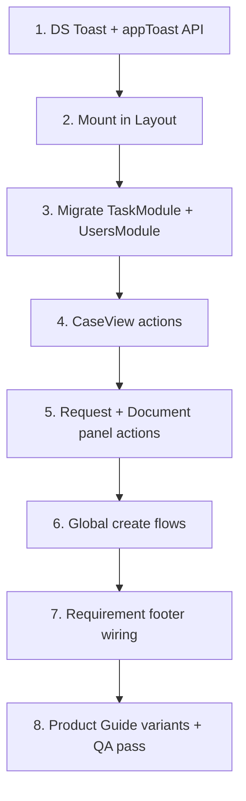

# Toast feedback — design system + action coverage plan

Goal: one **Amplify Toast** component in the design system (5 variants per spec), mounted once at app shell level, and **success / neutral / warning / alert / discovery** feedback on every meaningful object action.

Reference visuals: neutral grey, success green, warning orange (dark text), alert red, discovery purple — horizontal bar, leading semantic icon, message, dismiss **×**.

---

## Current state (audit)

### Toast implementations today

| Location | Style | Variants | Dismiss | Notes |
|----------|-------|----------|---------|-------|
| `CaseView.tsx` | Inline fixed bottom-right | `success`, `neutral` only | Auto only | Large 40×40 icon box — **does not match DS spec** |
| `TaskModule.tsx` | Duplicate inline green bar | success only | Auto only | Copy-paste of CaseView success |
| `UsersModule.tsx` | Centered grey pill | none (implicit neutral) | Auto only | Different position + shape |
| `AiActivityToast.tsx` | White card, AI Feed | N/A | Manual | **Keep separate** — multi-step agent activity, not action toast |

`sonner` is in `package.json` but **not used anywhere**.

### Where `setToast` / feedback actually fires

| Module | Actions with toast | Actions **without** toast |
|--------|-------------------|---------------------------|
| **Tasks** (`TaskModule`) | Pick up, release, complete, generic task action, create task | Same actions from **CaseView** side panel, **Dashboard** |
| **Case** (`CaseView`) | Copilot preview only (`neutral`) | Requirement add/edit/delete, task complete/action, decision recorded, scoring save, create task |
| **Requirement** | — | Footer buttons are **UI-only** (no handlers); modal save has no toast |
| **Document** | — | Mark reviewed (`TaskDetailSidePanel`, `RequestsModule`); document module actions |
| **Request** (`RequestsModule`) | — | `start_review`, `complete`, `reject`, `request_info`, mark evidence reviewed, create request |
| **Users** | Reassign, availability block | Profile updates (if any) |
| **Global create** | — | Case / task / request created (`GlobalCreateContext`, module modals) |

### Shared mutation layer (hook point)

`executePanelAction`, `executeTaskAction`, `executeRequestAction`, `updateDocumentStatus`, `upsertRequirement`, `deleteEntity` in `workflowActions.ts` / `datasetMutations.ts` — ideal place for **optional** centralized messages, but UI should call `toast()` at the call site for clearer copy.

---

## Phase 1 — Design system Toast

### 1.1 Add `Toast` to `/src/app/components/ds/`

**Files to add:**

```
src/app/components/ds/Toast.tsx          # Presentational bar
src/app/components/ds/ToastProvider.tsx  # Portal + queue (or thin sonner wrapper)
src/app/utils/app-toast.ts               # toast.success(), toast.neutral(), etc.
```

**Export from** `src/app/components/ds/index.ts`.

### 1.2 Variant spec (match screenshots + tokens)

| Variant | Background | Text | Icon (lucide) | Token source |
|---------|------------|------|---------------|--------------|
| `neutral` | `#2d3748` (slate) | white | `Info` | `COLORS.status.neutral` family |
| `success` | `#00a651` | white | `Check` | `COLORS.status.success.base` |
| `warning` | `#f5a200` / orange | **dark** (`#1b1c1e`) | `AlertTriangle` | `COLORS.status.warning.base` |
| `alert` | `#cd2c23` | white | `OctagonAlert` or `CircleAlert` | `COLORS.status.alert.base` |
| `discovery` | `#602fa0` | white | `Lightbulb` | `COLORS.status.discovery.base` |

**Layout (all variants):**

```
[ icon 16–20px ]  Message text (1–2 lines)                    [ × ]
```

- `rounded-md`, full-width bar inside `max-w-[min(440px, calc(100vw-3rem))]`
- **No** large 40×40 icon container (current CaseView/TaskModule pattern is wrong)
- `role="status"`, `aria-live="polite"`
- `data-ai-panel-ignore-outside` on wrapper (existing pattern for panel click-outside)

**Behavior:**

- Default position: `fixed bottom-6 right-6 z-[200]`
- Auto-dismiss: 4s neutral/success/warning/discovery; 6s alert (or manual only for alert per spec guidance)
- Manual dismiss via **×** button
- **Neutral ongoing actions:** message must end with `…` (ellipsis rule)
- Stack: max 3 visible; newest on top (if using queue)

### 1.3 Implementation choice

**Recommended:** Custom thin wrapper over **sonner** (already installed) with `toast.custom()` rendering our `Toast` bar — gets portal, queue, and dismiss for free.

**Alternative:** Lightweight `useState` queue in `ToastProvider` if we want zero sonner styling fights.

### 1.4 Mount once

Add `<AppToaster />` in `Layout.tsx` (inside `PlatformSettingsProvider` / `ActiveUserProvider` so copy can use profile name).

### 1.5 API

```ts
import { appToast } from '../utils/app-toast';

appToast.success('Task CD-5180 completed');
appToast.neutral('Document currently uploading…');
appToast.warning('Your license is about to expire');
appToast.alert('Unable to delete user');      // sparingly — system errors only
appToast.discovery('A discovery message!');
```

Optional: `appToast.fromPanelAction(action, objectLabel)` helper for consistent workflow copy.

### 1.6 Remove duplicates

After migration:

- Delete inline toast JSX from `CaseView.tsx`, `TaskModule.tsx`, `UsersModule.tsx`
- Replace with `appToast.*` calls

### 1.7 Platform Guide / Storybook

Add a **Toast** section in `ProductGuideModal` or settings preview showing all 5 variants (like existing DS demos).

---

## Phase 2 — Action → toast matrix

Use **success** for completed user actions, **neutral** for in-progress/system info, **warning** for non-blocking issues, **alert** only for system failures (not validation — use inline form errors).

### Case

| Action | Variant | Example message |
|--------|---------|-----------------|
| Decision recorded | success | `Decision recorded — Approved` |
| Requirement added | success | `Requirement added` |
| Requirement updated | success | `Requirement updated` |
| Requirement deleted | success | `Requirement removed` |
| Scoring item saved | success | `Scoring factor saved` |
| Case created (module / global) | success | `Case {id} created` |
| AI post-decision sequence starts | neutral | `Post-approval setup running…` | *(or keep AiActivityToast only)* |

**Files:** `CaseView.tsx`, `CasesModule.tsx`, `GlobalCreateContext.tsx`, `CaseScoringPanel.tsx`, `CaseRequirementModal` callback in CaseView.

### Task

| Action | Variant | Example message |
|--------|---------|-----------------|
| Pick up | success | `Task {id} picked up — now in My Tasks` |
| Release to queue | success | `Task {id} released to team queue` |
| Complete | success | `Task {id} completed` |
| Other workflow action | success | `{action label} recorded on {id}` |
| Task created | success | `Task {id} created` |
| Pick up / complete from **case panel** | success | same as TaskModule |
| Dashboard focus complete | success | same |

**Files:** `TaskModule.tsx` (swap to `appToast`), `CaseView.tsx` (`onCompleteTask`, `onTaskAction`), `TaskDetailSidePanel.tsx`, `Dashboard.tsx` if task actions exist, `GlobalCreateContext.tsx`, `CreateTaskModal` callbacks.

### Requirement

| Action | Variant | Example message |
|--------|---------|-----------------|
| Mark fulfilled *(wire footer)* | success | `Requirement marked fulfilled` |
| Reschedule / secondary actions *(when implemented)* | success | context-specific |
| Open from brief / panel | — | no toast (navigation only) |

**Files:** `RequirementContextBody.tsx` — add `onPrimaryAction` / `onSecondaryAction` props; parent executes mutation + toast.

### Document

| Action | Variant | Example message |
|--------|---------|-----------------|
| Mark reviewed / validated | success | `Document marked as reviewed` |
| Upload in progress *(future)* | neutral | `Document currently uploading…` |
| Review failed (system) | alert | `Unable to update document status` |

**Files:** `TaskDetailSidePanel.tsx` (`handleDocumentWorkflow`), `RequestsModule.tsx` (`handleDocumentWorkflow`), `CaseView.tsx` if document actions added, `DocumentModule.tsx`, `Dashboard.tsx` (evidence panel).

### Request

| Action | Variant | Example message |
|--------|---------|-----------------|
| Start review | success | `Review started on {requestId}` |
| Complete | success | `Request {id} completed` |
| Reject | success | `Request {id} rejected` |
| Request info | success | `Information request sent` |
| Create request | success | `Request {id} created` |
| Mark evidence reviewed | success | `Evidence marked as reviewed` |

**Files:** `RequestsModule.tsx` (`handleRequestPanelAction` — map `action.id` / `execution.action` to message), `CreateRequestModal.tsx`, `GlobalCreateContext.tsx`.

### Users (secondary)

| Action | Variant | Example message |
|--------|---------|-----------------|
| Reassign work | success | `Reassigned {n} task(s) to {name}` |
| Availability block saved | success | `Availability block saved for {name}` |

**Files:** `UsersModule.tsx`, `ReassignWorkModal.tsx`, `AvailabilityBlockModal.tsx`.

---

## Phase 3 — Implementation order



**Estimated touch count:** ~12–15 files, ~200–350 LOC (mostly deleting duplicate JSX).

---

## Phase 4 — QA checklist

- [ ] All 5 variants render correctly (icon + color + text contrast)
- [ ] Warning uses **dark** text on orange
- [ ] Neutral ongoing messages end with `…`
- [ ] × dismiss works; auto-dismiss does not fight hover
- [ ] Toast does not close side panels (`data-ai-panel-ignore-outside`)
- [ ] Only one toast position app-wide (bottom-right)
- [ ] Rapid actions queue or replace gracefully (no overlap clutter)
- [ ] Screen reader: `aria-live="polite"` on container

### Per-object smoke tests

| Flow | Expected toast |
|------|----------------|
| Tasks → Pick up → Complete | 2× success |
| Case → Add requirement | success |
| Case → Open task → Complete | success |
| Case → Record decision | success |
| Request panel → Start review | success |
| Task panel → Mark evidence reviewed | success |
| Global + → Create case | success |
| Copilot sends preview | neutral |

---

## Out of scope (for this pass)

- Replacing `AiActivityToast` with standard toast (different UX purpose)
- Inline form validation errors → keep field-level errors, not toast
- Batch operations → single summary toast only
- i18n keys for toast strings (can follow in a later pass with `react-i18next`)

---

## Design tokens follow-up

Add to `design-tokens.ts` under `COLORS.toast`:

```ts
toast: {
  neutral: { bg: '#2d3748', text: '#ffffff' },
  success: { bg: '#00a651', text: '#ffffff' },
  warning: { bg: '#f5a200', text: '#1b1c1e' },
  alert: { bg: '#cd2c23', text: '#ffffff' },
  discovery: { bg: '#602fa0', text: '#ffffff' },
}
```

Use tokens in `Toast.tsx` — no hardcoded hex in feature modules.
